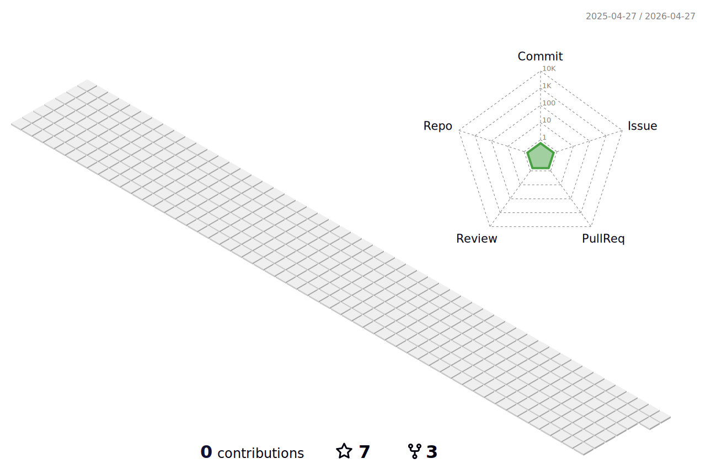

<!-- capsule render -->
 

***

### 🧑🏻‍💻 About Me

  

***

### 🏛️ Projects
|Period|Title|Description|Place|
|---|---|---|---|
|2024.01 ~ 2024.03|[DonWorry](https://github.com/dnd-side-project/dnd-10th-3-backend)|간단한 테스트로 축의금, 결혼식 관련 고민을 해결하고 나누는 커뮤니티 서비스|DND|
|2023.05 ~ 2023.12|[Howbachu](https://github.com/HowBaChu/Backend)|매일 바뀌는 한 가지 주제로 토론이 진행되는 플랫폼|명지대학교|
|2023.08 ~ 2023.09|[Chatfia](https://github.com/Techit-Springles/Backend)|채팅으로 진행되는 마피아 게임|멋쟁이사자처럼|
|2023.05 ~ 2023.07|[Cold Pitch](https://github.com/MightyLions/Cold_Pitch)|초기 스타트업의 아이디어 개선을 위한 리뷰 솔루션|HRD 해커톤 5기|
|2022.09 ~ 2022.12|[MJ AC](https://github.com/MJU-WC/WC-BACK)|등록된 일정을 날씨에 기반해 관리해주는 캘린더|캡스톤디자인2|
|2022.03 ~ 2022.07|[ECTI](https://github.com/dlrjs2360/Capstone1-ECTI)|지역별 전기 사용량 데이터 기반 사용자 전기 사용량 분위 분석 서비스|캡스톤디자인1|
|2022.03 ~ 2022.06|[Cak_k](https://github.com/CAKK-official)|서울 곳곳에 퍼져있는 주문 제작 케이크 가게 정보를 모아주는 플랫폼|Prography|
|2022.01 ~ 2022.03|[Cotato Web](https://github.com/Cotato-Web-Project)|동아리 홈페이지 제작|Cotato|

***
  
### 📚 My Skills
  
##### Programming Languages

  
  
  

##### Frameworks & Other Systems 

  
  
  
   
  
  
  

##### Infrastructure

  
  
  
   
  
  

***

### 🧩 Problem Solving

<!--
### 💻 GitHub

  

 

  <!-- github graph -->
 <!---->

 

<a>
  
<!---->
<!---->
  
</a>
  

