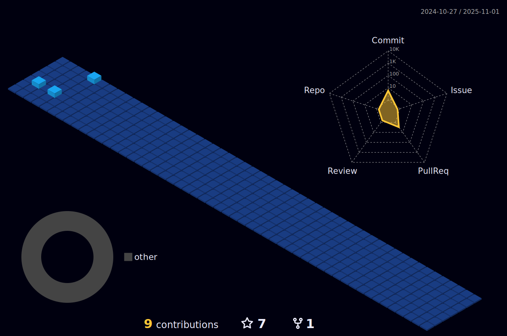

<!-- capsule render -->
 
  

  

  
  
<h1>📚  &nbsp Skills </h1>
  

  <h3>💡Using</h3>
  </a>&nbsp
  </a>&nbsp
  </a>&nbsp
  <h3>💡Used</h3>
  </a>&nbsp
  </a>&nbsp
  </a>&nbsp
   
  <h3>💡Algorithm</h3>
  </a>&nbsp

 

<h1>📑 &nbsp Algorithm </h1>
<a>

  </a>

 

<h1>💻 &nbsp GitHub </h1>

<!--  -->

 

  <!-- github graph -->
 <!---->

 

<a>
  
<!---->
<!---->
  
</a>
  

 

